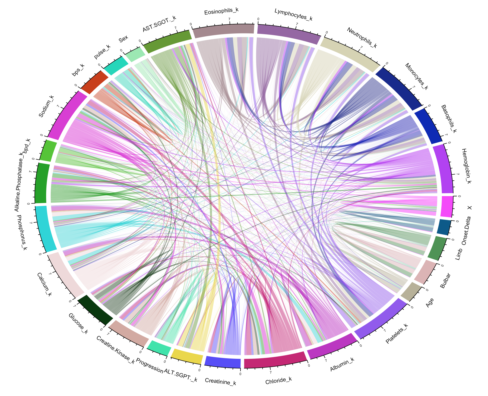
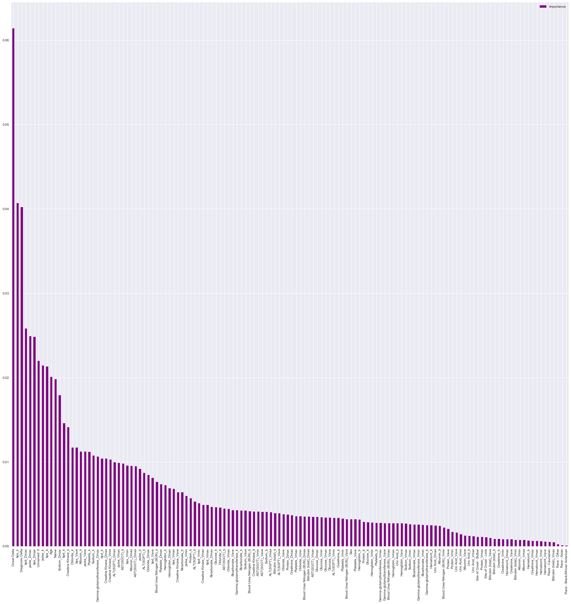
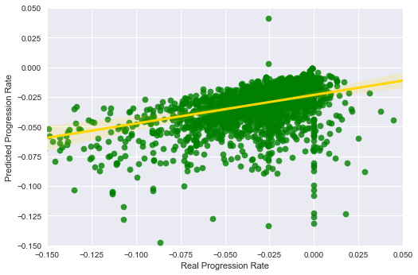
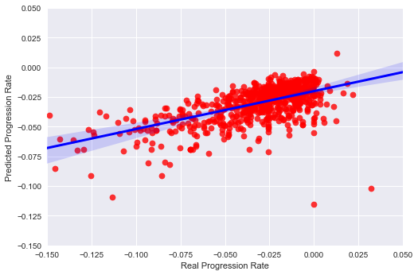

# ALS Progression Prediction Project

<a href=""></a>

**ALS** (full name: **Amyotrophic Lateral Sclerosis**) is a fatal motor neuron disease with substantial heterogeneity in genomics as well as clinical features. ALS is usually very progressive with very short survival after onset. Here we applied machine learning approaches to predict rate of progression based on available clinical data for ~5000 patients.


<br>

# Introduction
We have ~5000000 lines of data about all features including demographics, clinical trial as well as lab test results for ~5000 ALS patients provided by PRO-ACT(Pooled Resource Open-Access ALS Clinical Trial Database).<br>
Clinically Progression Rate (PR) is very important feature for ALS patients, so our purpose here is to 
predict PR based on available patient features.<br>


# Data Snippet

```python

 89	Demographics	Sex	         Male 
329	Demographics 	Sex	         Female 
329	Demographics	Race             American Indian
329	Demographics	Race             Asian
329	ALSFRS(R)	ALSFRSDelta	 189 
329	ALSFRS(R)	ALSFRSTotal	 25  
329	ALSFRS(R)	ALSFRSDelta	 212 
329	ALSFRS(R)	ALSFRSTotal	 30 
329	LaboratoryData	LaboratoryDelta  100 
329	LaboratoryData	TestName	 Sodium  
329	LaboratoryData	TestResult	 138     
329	LaboratoryData	TestUnit	 mmol/L  

```

# Analysis

## I. Overview 
Features include Static Feature (sex, age) and Dynamic Feature(Sodium concentration change over time).<br>


## II. Feature Engineering & Data Cleaning
1. First calculate our target variable: Progression Rate (Delta Health score/Delta time).  

2. Covert time-dependent dynamic features into static:
   Simple linear regression, and use k,b as new static feature.
   In case data points are too few for fit, we also reserve Max() and Min() as new feature.

3. Convert character features into numeric (For example for 'Sex')

4. Merge multiple dataframes and drop features(columns) containing NaN in >50% of its cells. 
   For remaining NaN we fill in with median of that column.

5. We eventually generated a (5372 * 134) dataframe with 5372 patients and 134 features.


## III. Model Selection: Random Forest Regression
1. Feature correlation

   Some features are highly correlated, for example, Sodium and Chloride concentration, 
   also ALT(SGPT) and AST(SGOT),two aminotransferases enzymes.
   Some correlated features are interesting, such as platelets count and pulse.
   
   <p align="center">
   
   </p>

2. RandomForestRegressor 

   We applied RandomForestRegressor to train data. And from this model, the top important predictive features
   include Onset delta, systolic blood pressure, pulse, Sodium and creatine kinase.
   <p align="center">
   
   </p>


3. Prediction using Cross-Validated and test data

   The correlation coefficient between predicted and real Progression Rate are 0.46 and 0.65 for 
   cross validation data and test data, respectively.
   <p align="center">
   
   </p>
   
   <p align="center">
   
   </p>
   
   
## IV. Summary and Looking Forward
1. Clinical data, esp. for rare disease like ALS, are extremely noisy with many missing data.
2. Random Forest is optimal for study non-linear features in high-dimentional data.
3. Open door to new predictive features like blood pressure, pulse and creatine kinase.
4. Could help us reduce the clinical trial number for ALS patients.


