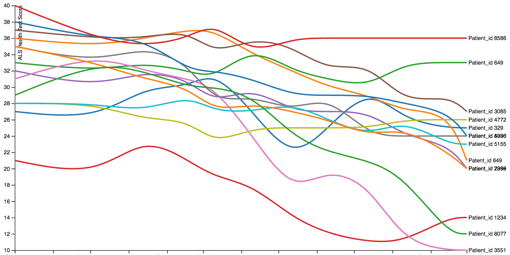
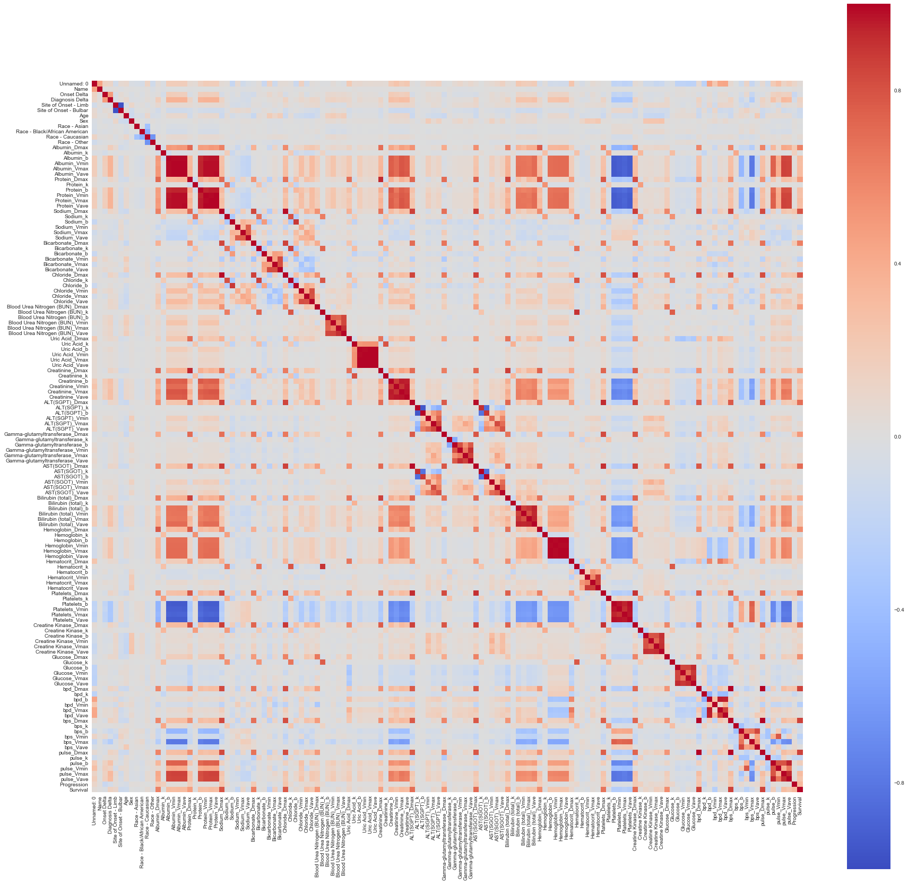

# ALS Progression Prediction Project

<a href=""></a>

**ALS** (full name: **Amyotrophic Lateral Sclerosis**) is a fatal motor neuron disease with substantial heterogeneity in genomics as well as clinical features. ALS is usually very progressive with very short survival after onset. Here we applied machine learning approaches to predict rate of progression based on available clinical data for ~5000 patients.


<br>

# Introduction
We have ~5000000 lines of data about all features including demographics, clinical trial as well as lab test results for ~5000 ALS patients provided by PRO-ACT(Pooled Resource Open-Access ALS Clinical Trial Database).


# Data Snippet

```js

89	144	Demographics	B17A1C73-0A2B-4091-842C-D5841EF339FD	1205	Sex	Male 
329	144	Demographics	704CA13F-C1FA-49EC-A3BB-E6B00FA075FA	1205	Sex	Female 
329	144	Demographics	704CA13F-C1FA-49EC-A3BB-E6B00FA075FA	1206	Race - American Indian/Alaska Native
329	144	Demographics	704CA13F-C1FA-49EC-A3BB-E6B00FA075FA	1207	Race - Asian
329	145	ALSFRS(R)	8F97FE2C-5B03-4491-AA3E-52883C47FCE6	1225	ALSFRS Delta	189 
329	145	ALSFRS(R)	8F97FE2C-5B03-4491-AA3E-52883C47FCE6	1228	ALSFRS Total	25  
329	145	ALSFRS(R)	31D06255-09B0-4265-9477-D872DC6DD78A	1225	ALSFRS Delta	212 
329	145	ALSFRS(R)	31D06255-09B0-4265-9477-D872DC6DD78A	1228	ALSFRS Total	30 
329	146	Laboratory Data	1150FF83-DA3B-436E-B444-D1CA2A22E08C	1234	Laboratory Delta	0 
329	146	Laboratory Data	1150FF83-DA3B-436E-B444-D1CA2A22E08C	1250	Test Name	Sodium  
329	146	Laboratory Data	1150FF83-DA3B-436E-B444-D1CA2A22E08C	1251	Test Result	138     
329	146	Laboratory Data	1150FF83-DA3B-436E-B444-D1CA2A22E08C	1252	Test Unit	mmol/L  

```

# Analysis

## I. Overview 
Features include Static Feature (sex, age) and Dynamic Feature(Sodium concentration change over time).
Dynamic feature. Our target variable Progression Rate is also dynamic (Delta Health score/Delta time).
Clinically Progression Rate (PR) is very important feature for ALS patients, so our purpose here is to 
predict PR based on available patient features.
In the whole analysis, we applied Pandas Dataframe and grouped all noisy data by patients.


## II. Feature Engineering & Data Cleaning
1. Progression rate figure:   
   <p align="center">
   
   </p>


2. Covert time-dependent dynamic features into static:
   Derive least squares polynomial fit, and use k,b as new static feature.
   In case data points are too few for fit, we also reserve Max() and Min() as new feature.

3. Convert character features into numeric (For example for 'Sex')

4. Merge multiple dataframes and drop features(columns) containing NaN in >50% of its cells. 
   For remaining NaN we fill in with median of that column.

5. We eventually generated a (5372 * 134) dataframe with 5372 patients and 134 features.


## III. Model Selection: Random Forest Regression
1. Feature correlation

   Some features are highly correlated, for example, Sodium and Chloride concentration, 
   also ALT(SGPT) and AST(SGOT),two aminotransferases enzymes.
   Some correlated features are interesting, such as platelets count and pulse.
   
   <p align="center">
   
   </p>

2. RandomForestRegressor 

   We applied RandomForestRegressor to train data. And from this model, the top important features
   include Onset delta, systolic blood pressure, pulse, Sodium and creatine kinase.
   <p align="center">
   
   </p>


3. Prediction using Cross-Validated and test data

   The correlation coefficient between predicted and real Progression Rate are 0.46 and 0.65 for 
   cross validation data and test data, respectively.
   <p align="center">
   
   </p>
   
   <p align="center">
   
   </p>
   
   
## IV. Looking Forward
1. Clinical data, esp. for rare disease like ALS, are extremely noisy with many missing data.
2. Random Forest is optimal for study non-linear features in high-dimentional data.
3. Open door to new predictive features like blood pressure, pulse and creatine kinase.


